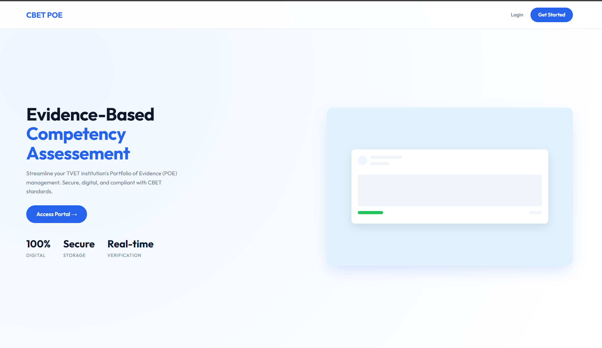
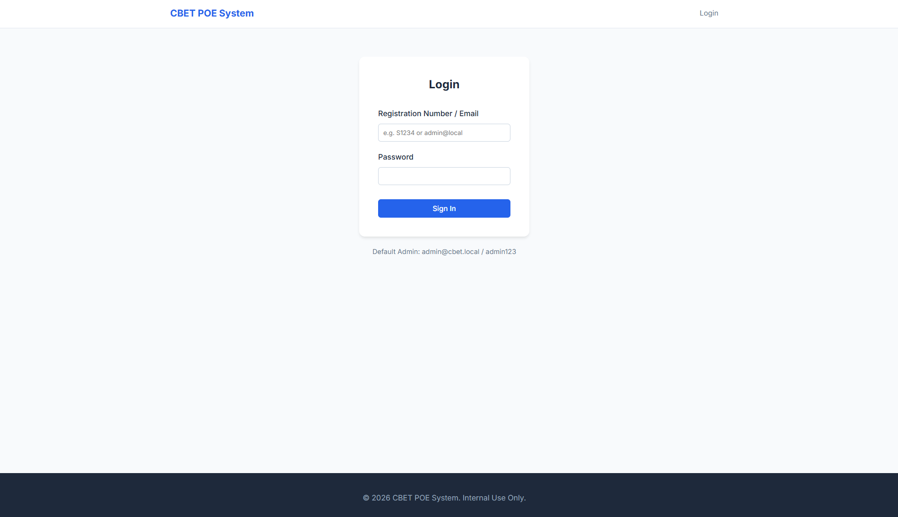

# SYSTEM DOCUMENTATION: CBET POE RECORD-KEEPING SYSTEM

**Project Title:** Competency Based Education & Training (CBET) Portfolio of Evidence (POE) System  
**Version:** 1.0  
**Date:** February 2026

---

## TABLE OF CONTENTS

1. **PRELIMINARY PAGES**
    - Abstract
    - List of Abbreviations
2. **CHAPTER 1: INTRODUCTION**
    - 1.1 Background of the Study
    - 1.2 Problem Statement
    - 1.3 Objectives of the System
    - 1.4 Significance of the System
    - 1.5 Scope of the Project
3. **CHAPTER 2: SYSTEM ANALYSIS & REQUIREMENTS**
    - 2.1 Existing System Analysis
    - 2.2 Functional Requirements
    - 2.3 Non-Functional Requirements
    - 2.4 User Roles & Permissions
4. **CHAPTER 3: SYSTEM DESIGN**
    - 3.1 System Architecture (MVC)
    - 3.2 Database Design
    - 3.3 Security Implementation
5. **CHAPTER 4: IMPLEMENTATION**
    - 4.1 Development Environment & Tools
    - 4.2 Key Features & Modules
    - 4.3 Code Structure & Standards
6. **CHAPTER 5: TESTING & VALIDATION**
    - 5.1 Testing Strategy
    - 5.2 Test Cases
7. **CHAPTER 6: CONCLUSION & RECOMMENDATIONS**

---

## ABSTRACT

The proliferation of Competency Based Education and Training (CBET) demands rigorous evidence collection and verification. The traditional paper-based Portfolio of Evidence (POE) system faces challenges regarding data integrity, storage, accessibility, and the efficiency of the internal verification process. This project, the **CBET POE System**, serves as a digital platform to streamline the submission, assessment, and verification of student evidence. By leveraging a secure Model-View-Controller (MVC) architecture, the system ensures real-time feedback, meaningful audit trails, and role-specific workflows for Students, Trainers, Internal Verifiers (IVs), and Administrators. This document details the system's analysis, design, and implementation, demonstrating its capability to modernize institutional assessment records.

---

## CHAPTER 1: INTRODUCTION

### 1.1 Background of the Study
Technical and Vocational Education and Training (TVET) institutions are shifting towards CBET curriculums, which prioritize demonstating competence over rote learning. A critical component of this is the **Portfolio of Evidence (POE)**, a collection of proofs (documents, videos, images) showing a student's mastery of specific units. Managing these physical portfolios for thousands of students is logistically complex and prone to loss.

### 1.2 Problem Statement
The manual handling of POEs presents several critical issues:
1.  **Storage & Retrieval:** Physical files take up massive space and are difficult to search.
2.  **Verification Bottlenecks:** Internal Verifiers (IVs) must physically locate files to sample assessments, slowing down quality assurance.
3.  **Lack of Feedback Loop:** Students often receive feedback too late to make corrections.
4.  **Data Integrity:** Physical signatures and grades can be altered or lost.

### 1.3 Objectives of the System
**General Objective:**  
To design and develop a web-based CBET POE System that digitizes the submission, grading, and storage of student assessment evidence.

**Specific Objectives:**
1.  To enable **Students** to upload digital evidence (PDF/Images) securely from any device.
2.  To provide **Trainers** with a digital dashboard for reviewing, grading, and providing visual feedback on evidence.
3.  To facilitate **Internal Verification** by allowing IVs to virtually sample, verify, or reject graded work.
4.  To generate automated **Progress Reports** and maintain comprehensive **Audit Logs** of all system activities.

### 1.4 Significance of the System
*   **For the Institution:** Reduces paper costs and storage needs; ensures compliance with TVET authority standards.
*   **For Trainers:** streamlines the marking process and calculation of competency.
*   **For Students:** Provides 24/7 access to their POE and immediate feedback on their progress.

### 1.5 Scope of the Project
The system covers the following modules:
*   User Management (Admin, HOD, Trainer, IV, Student).
*   Academic Structure (Courses, Classes, Units, Assessment Slots).
*   Evidence Submission & File Handling.
*   Grading & Internal Verification Logic.
*   Reporting & Audit Trails.
*   *Limitation:* The system currently focuses on internal institutional assessments and does not integrate directly with national centralized exam bodies yet.

---

## CHAPTER 2: SYSTEM ANALYSIS & REQUIREMENTS

### 2.1 Existing System Analysis
Currently, students print assignments, physically hand them to trainers, who mark them with red pens. These files are stored in cabinets.
*   **Risks:** Fire/Water damage, lost pages, misfiled documents.
*   ** inefficiencies:** "Files missing" is a common excuse for delayed verification.

### 2.2 Functional Requirements
The system provides the following functions:
*   **Registration/Login:** Secure access via Email/Registration Number.
*   **Batch Operations:** Admins can bulk-import students and units via CSV.
*   **Assessment Creation:** Trainers define "Slots" (e.g., "Written Test 1", "Practical 1") and upload Question Papers.
*   **Evidence Handling:** Support for PDF, DOCX, and Image uploads with server-side validation.
*   **Status Workflow:** Evidence moves effectively through states: `Not Submitted` -> `Submitted` -> `Graded` -> `Verified` (or `Rejected`).

### 2.3 Non-Functional Requirements
1.  **Security:** Passwords hashed using `bcrypt`. SQL Injection protection via PDO prepared statements.
2.  **Usability:** Mobile-responsive design for students using smartphones.
3.  **Performance:** Optimized queries to handle thousands of records in grading matrices.
4.  **Availability:** Web-based architecture ensures 99.9% uptime potential.

### 2.4 User Roles & Permissions
*   **Administrator:** Full system configuration, bulk imports, role assignment.
*   **HOD (Head of Dept):** Views reports and progress for their department.
*   **Trainer:** Creates assessments, marks evidence, tracks class progress.
*   **Internal Verifier (IV):** Samples graded work, approves or rejects trainer decisions.
*   **Student:** Uploads evidence, views feedback and grades.

---

## CHAPTER 3: SYSTEM DESIGN

### 3.1 System Architecture
The system adopts the **Model-View-Controller (MVC)** architectural pattern to separate logic, data, and presentation.

*   **Model:** Direct interaction with the MySQL database (e.g., `SubmissionModel.php`, `UserModel.php`).
*   **View:** HTML/CSS templates rendering the UI (e.g., `class_view.php`, `unit_view.php`).
*   **Controller:** Handles user requests and orchestrates data flow (e.g., `ReviewController.php`, `AuthController.php`).



### 3.2 Database Design
The database manages complex relationships between academic units and user submissions.

**Key Entities:**
1.  **Users:** Stores credentials, roles, and department links.
2.  **Units & Classes:** Defines the academic hierarchy.
3.  **Assessment_Slots:** The definitions of what needs to be submitted.
4.  **POE_Submissions:** The actual evidence files and status.
5.  **POE_Reviews:** Audit trail of grading decisions and IV comments.

*(ERD skipped - using application views)*

### 3.3 Security Design
*   **Session Management:** Secure PHP sessions with timeout logic.
*   **Input Sanitization:** `htmlspecialchars` used on all outputs to prevent XSS.
*   **File Security:** Uploads are renamed with unique hashes (`user_slot_timestamp`) to prevent overwrites and execution attacks.

---

## CHAPTER 4: IMPLEMENTATION

### 4.1 Development Environment
*   **Server:** Apache (XAMPP).
*   **Language:** PHP 8.2 (Core/Vanilla implementation for performance and control).
*   **Database:** MySQL / MariaDB.
*   **Frontend:** HTML5, Modern CSS (Flexbox/Grid), JavaScript (ES6).

### 4.2 Key Modules Description

#### 4.2.1 Authentication Module
Allows users to login using either their **Email** or **Registration Number**.
*   *Feature:* Role-based redirection (Students go to My POE, Admins to Dashboard).


#### 4.2.2 Assessment Framework
Trainers create specific "Slots". A slot represents a placeholder for evidence.
*   *Code Highlight:* The `AssessmentController` ensures only authorized trainers can modify slots for their assigned units.


#### 4.2.3 Evidence Submission (Student POV)
Students see a clear list of units. Color-coded badges indicate status (`Pending`, `Submitted`, `Approved`).
*   *Innovation:* In-browser preview allows students to check their file before submission.
*   *Feedback:* If rejected, the trainer's comment appears visibly in a red alert box.


#### 4.2.4 The Grading & Verification Matrix
A powerful grid view for Trainers and IVs.
*   **Trainers:** Click a cell to view evidence and grade it.
*   **IVs:** See "Sample" buttons appear only on Graded work.


### 4.3 Code Structure
The application follows a strict directory structure:
```
/app
  /Controllers  # Business Logic
  /Models       # Database Logic
  /Views        # UI Templates
/public         # Web Root (css, js, uploads)
/config         # Database setup
```

---

## CHAPTER 5: TESTING & VALIDATION

### 5.1 Testing Strategy
We employed **Unit Testing** for individual functions (e.g., file upload validation) and **System Testing** for complete workflows.

### 5.2 Test Cases

#### Test Case 1: Student Submission
1.  **Action:** Student logs in, navigates to "Unit 101", uploads "evidence.pdf".
2.  **Expected Result:** File saves to `uploads/`, database updates status to 'Submitted'.
3.  **Actual Result:** Success. Green "Submitted" badge appears.


#### Test Case 2: IV Rejection Workflow
1.  **Action:** Trainer grades as "Competent". IV logs in, samples evidence, finds a gap, clicks "Reject" with comment "Missing Page 2".
2.  **Expected Result:** Status reverts to "Rejected", Student sees "Missing Page 2" on their dashboard.
3.  **Actual Result:** Success. Feedback visible in Red Box on Student View.


---

## CHAPTER 6: CONCLUSION

The **CBET POE System** successfully addresses the inefficiencies of manual record-keeping. By digitizing the process, we have ensured:
1.  **Permanence:** Records are safe from physical damage.
2.  **Accountability:** Every grade and verification has a digital footprint.
3.  **Efficiency:** The time from submission to verification is drastically reduced.

Future enhancements will include integration with the National TVET Management Information System (MIS) for automated graduation list generation.

---
*End of Documentation*
